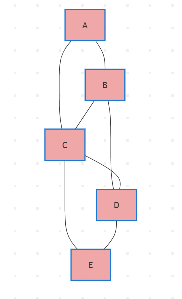
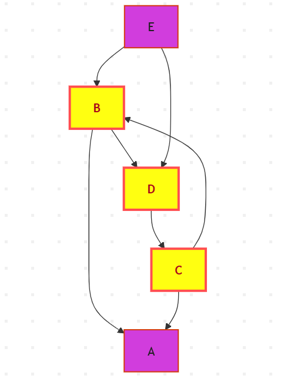

## Problem 1 (Graph and Tree Definitions, 5/10 pts)  
**Prove that the following 7 definitions of a tree are equivalent.**

Let $ G = (V, E) $ be a simple undirected graph with $ n = |V| $ vertices and $ m = |E| $ edges.

We prove that **all seven definitions are logically equivalent** by establishing a **cycle of implications**:  
**1 → 2 → 3 → 4 → 5 → 6 → 7 → 1**

---

### **1 → 2**  
> **1.** *A tree is a connected acyclic graph.*  
> **2.** *A tree is one component of a forest (where a forest is an acyclic graph).*

**Proof:**  
- By (1), $ G $ is **acyclic** → it is a **forest** (by definition of forest).  
- Also, $ G $ is **connected** → it has **exactly one connected component**.  
- Therefore, $ G $ is **one component of a forest**.  
∴ **1 ⇒ 2**

---

### **2 → 3**  
> **3.** *A tree is a connected graph with at most $ n−1 $ edges.*

**Proof:**  
- By (2), $ G $ is a **connected component of a forest**.  
- In any forest with $ c $ components, $ m \leq n - c $.  
- Here, $ c = 1 $ → $ m \leq n - 1 $.  
- Also, $ G $ is **connected** → $ m \geq n - 1 $ (minimum edges for connectivity).  
- Thus, $ m = n - 1 $.  
- So $ G $ is **connected** and has **at most $ n−1 $ edges** (actually exactly).  
∴ **2 ⇒ 3**

---

### **3 → 4**  
> **4.** *A tree is a minimally connected graph: removing any edge disconnects it.*

**Proof:**  
- By (3), $ G $ is **connected** and $ m \leq n-1 $.  
- Suppose $ m < n-1 $ → then $ G $ is disconnected (contradiction).  
- ∴ $ m = n-1 $.  
- Now remove any edge $ e $ → new edge count = $ n-2 $.  
- A connected graph needs at least $ n-1 $ edges → with $ n-2 $, it **must be disconnected**.  
- Thus, removing **any** edge disconnects $ G $.  
∴ **3 ⇒ 4**

---

### **4 → 5**  
> **5.** *A tree is an acyclic graph with at least $ n−1 $ edges.*

**Proof:**  
- By (4), $ G $ is **connected** → $ m \geq n-1 $.  
- Also, **minimally connected**: no edge can be removed without disconnecting →  
  → there is **no cycle** (because a cycle contains a removable edge).  
- ∴ $ G $ is **acyclic** and $ m \geq n-1 $.  
- But from (4), removing any edge disconnects → $ m $ cannot be $ > n-1 $ (else removable).  
- ∴ $ m = n-1 $.  
- So $ G $ is **acyclic** with **at least $ n−1 $ edges** (exactly).  
∴ **4 ⇒ 5**

---

### **5 → 6**  
> **6.** *A tree is a maximally acyclic graph: adding any edge between two vertices creates a cycle.*

**Proof:**  
- By (5), $ G $ is **acyclic** and $ m \geq n-1 $.  
- Suppose $ m < n-1 $ → then $ G $ is disconnected → pick two vertices in different components → add edge → no cycle (still forest).  
- Contradiction to maximality → ∴ $ m = n-1 $.  
- Now, add any non-edge $ uv \notin E $:  
  - Since $ m = n-1 $ and $ G $ is a forest → it is **connected** (one component).  
  - ∴ path from $ u $ to $ v $ exists.  
  - Adding $ uv $ creates a **cycle**: $ u \to v $ (new) + $ v \to \cdots \to u $ (existing).  
- Thus, adding **any** edge creates a cycle.  
∴ **5 ⇒ 6**

---

### **6 → 7**  
> **7.** *A tree is a graph that contains a unique path between each pair of vertices.*

**Proof:**  
- By (6), $ G $ is **acyclic** and **maximally acyclic**.  
- **Connectedness**:  
  - Take any $ u, v $. If no path → add edge $ uv $ → no cycle (disconnected) → contradicts maximality.  
  - ∴ path exists → $ G $ is **connected**.  
- **Uniqueness**:  
  - Suppose two distinct paths $ P_1, P_2 $ from $ u $ to $ v $.  
  - Their symmetric difference contains a **cycle** → contradicts acyclicity.  
  - ∴ **unique path** between any pair.  
∴ **6 ⇒ 7**

---

### **7 → 1**  
> **1.** *A tree is a connected acyclic graph.*

**Proof:**  
- By (7):  
  - Path exists between any pair → **connected**.  
  - Suppose a cycle exists: $ v_1 \to v_2 \to \cdots \to v_k \to v_1 $.  
  - Then two paths from $ v_1 $ to $ v_k $:  
    - forward along cycle  
    - backward along cycle  
  - → contradicts **unique path**.  
  - ∴ **no cycles** → **acyclic**.  
∴ **7 ⇒ 1**

---

### **Conclusion**

We have shown:  
**1 ⇒ 2 ⇒ 3 ⇒ 4 ⇒ 5 ⇒ 6 ⇒ 7 ⇒ 1**  

Therefore, **all seven definitions are logically equivalent**.

---------

## Problem 2 (Sparse representation of graphs, 5/10 pts)  
**Given:** CSC (Compressed Sparse Column) representations for two graphs on vertices  
**{A, B, C, D, E}** (indexed as **A→0, B→1, C→2, D→3, E→4**).

---

### Graph 1 (undirected)

```text
col_pointers = [0, 2, 5, 8, 11, 12]
row_indices = [1, 2, 0, 2, 3, 0, 1, 3, 1, 2, 4, 3]
values = [1, 1, 1, 1, 1, 1, 1, 1, 1, 1, 1, 1]
```

### (a) Adjacency Matrix
```
  A B C D E
A 0 1 1 0 0
B 1 0 1 1 0
C 1 1 0 1 1
D 0 1 1 0 1
E 0 0 1 1 0
```

Symmetric → undirected

### b) diagram's separate pngs 
you can see it on s_9/exo_5/diagrams/undirected_graph.png 



### Graph 2 (directed)

```
col_pointers = [0, 0, 2, 4, 5, 7]
row_indices = [0, 3, 0, 1, 2, 1, 3]
values  = [1, 1, 1, 1, 1, 1, 1]
```
### (a) Adjacency Matrix

```
    A B C D E
  A 0 0 0 0 0
  B 1 0 0 1 0
  C 1 1 0 0 0
  D 0 0 1 0 0
  E 0 1 0 1 0
```
Not symmetric → directed. 

### b) diagram's separate pngs 
you can see it on s_9/exo_5/diagrams/directed_graph.png 


Cycle C → B → D → C is highlighted in yellow.

### c) Unique Cycle in Directed Graph
C → B → D → C
Verification:

Only one cycle exists.
Nodes A and E have no outgoing path back into the cycle.
No other closed walks.