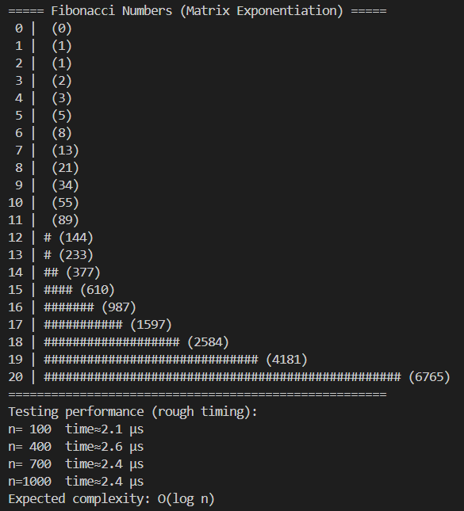
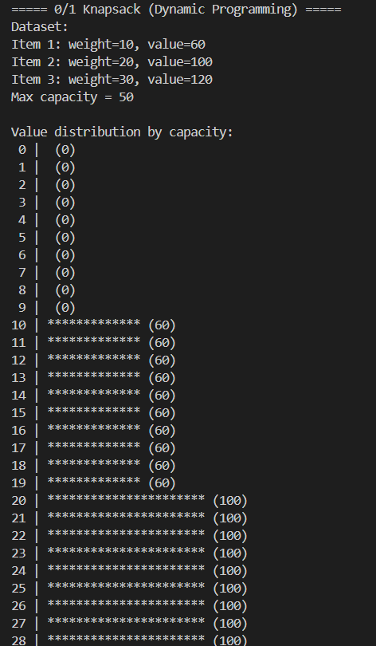
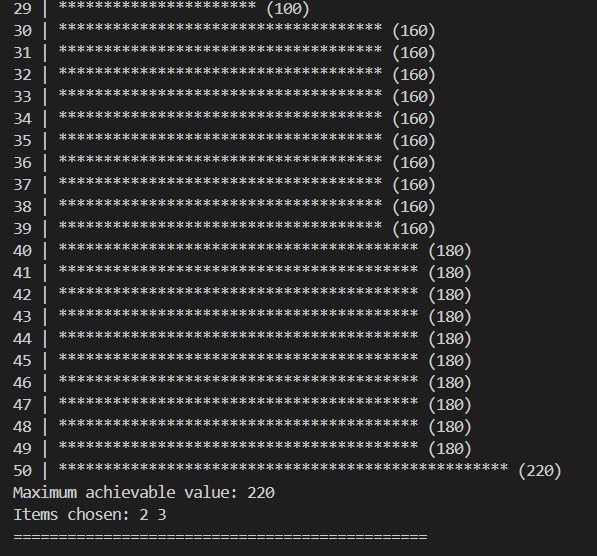
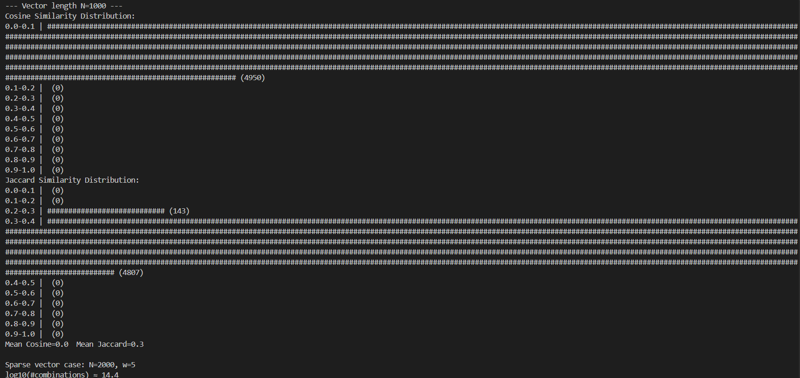

### 🟦 Fibonacci Output Example

Computes Fibonacci numbers using **matrix exponentiation** in *O(log n)* time and visualizes growth with text-based bars.

---

### 🟩 Knapsack Output Example

Solves the **0/1 Knapsack problem** using dynamic programming, showing how total value changes with increasing capacity.

---

### 🟨 Neuro Computing Output Example

Generates random binary vectors and compares them using **Cosine** and **Jaccard similarity**, displaying distribution histograms in text form.
