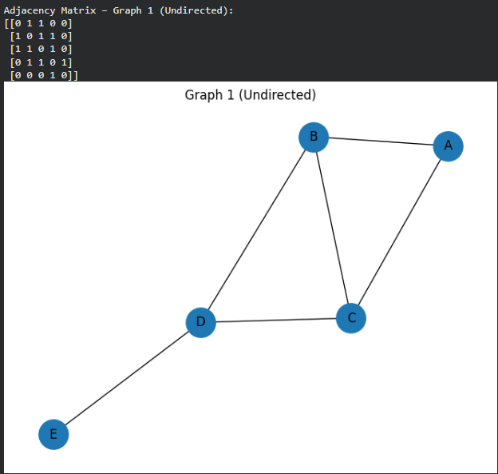
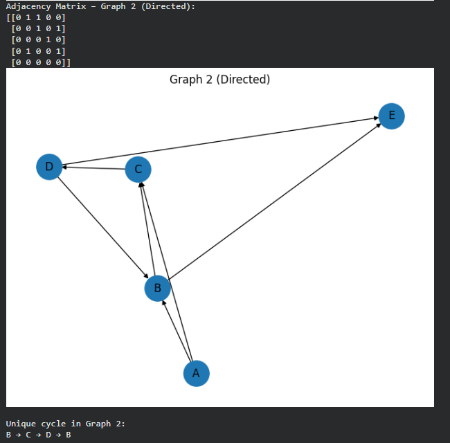

# Graph Reconstruction (CSC Format)
This project converts **Compressed Sparse Column (CSC)** graph data into:
- Adjacency matrices  
- Visual graph diagrams (using NetworkX)  
- Cycle detection for the directed graph  
---
## Output Graphs
### Undirected Graph (Graph 1)

### Directed Graph (Graph 2)

---
## Included Tasks
1. Reconstruct adjacency matrix from CSC arrays  
2. Draw the undirected graph (Graph 1)  
3. Draw the directed graph (Graph 2)  
4. Detect the unique cycle in the directed graph  
---
## Example of Cycle Detection
A → B → C → A
---