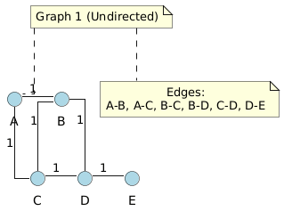
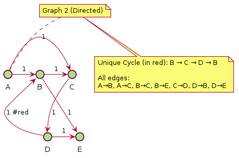

# Graph Theory Problems - Solutions

## Problem 1: Equivalence of Tree Definitions

**Goal:** Prove that all seven definitions of a tree are equivalent.

### The Definitions:
1. A tree is a connected acyclic graph
2. A tree is one component of a forest (a forest is an acyclic graph)
3. A tree is a connected graph with at most V - 1 edges
4. A tree is a minimally connected graph; removing any edge disconnects the graph
5. A tree is an acyclic graph with at least V - 1 edges
6. A tree is a maximally acyclic graph; adding an edge between any two vertices creates a cycle
7. A tree is a graph that contains a unique path between each pair of vertices

### Proof Strategy:
We'll prove: (1) ⇒ (2) ⇒ (3) ⇒ (4) ⇒ (5) ⇒ (6) ⇒ (7) ⇒ (1)

---

### (1) ⇒ (2): Connected acyclic ⇒ One component of forest

**Proof:** 
- Assume G is a connected acyclic graph
- A forest is defined as an acyclic graph
- Since G is acyclic, it is a forest
- Since G is connected, it has exactly one connected component
- Therefore, G is one component of a forest (specifically, a forest with one component) ✓

---

### (2) ⇒ (3): One component of forest ⇒ Connected with ≤ V-1 edges

**Proof:**
- Assume G is one component of a forest (so G is connected and acyclic)
- We prove by induction on V that an acyclic graph on V vertices has at most V-1 edges
- **Base case:** V = 1, then E = 0 ≤ 0 ✓
- **Inductive step:** Assume true for all graphs with < V vertices
  - Take any acyclic graph G with V vertices
  - If E = 0, then E ≤ V-1 ✓
  - If E > 0, remove any edge e = (u,v)
  - Since G is acyclic, removing e creates two components G₁ and G₂
  - Let |V₁| = k, |V₂| = V-k where k ≥ 1
  - By induction: |E₁| ≤ k-1 and |E₂| ≤ (V-k)-1
  - So E = |E₁| + |E₂| + 1 ≤ (k-1) + (V-k-1) + 1 = V-1 ✓

---

### (3) ⇒ (4): Connected with ≤ V-1 edges ⇒ Minimally connected

**Proof:**
- Assume G is connected with at most V-1 edges
- First, we show G has exactly V-1 edges:
  - Any connected graph needs at least V-1 edges (standard theorem)
  - We have at most V-1 edges
  - Therefore, G has exactly V-1 edges
- Now suppose we remove any edge e
- G has V vertices and V-2 edges after removal
- A connected graph on V vertices needs at least V-1 edges
- Therefore, G becomes disconnected
- Thus G is minimally connected ✓

---

### (4) ⇒ (5): Minimally connected ⇒ Acyclic with ≥ V-1 edges

**Proof:**
- Assume G is minimally connected
- G is connected, so it has at least V-1 edges (standard result)
- We need to show G is acyclic
- Suppose G has a cycle C
- Pick any edge e in C
- Removing e keeps G connected (we can still travel through the rest of C)
- This contradicts minimal connectivity
- Therefore G is acyclic with at least V-1 edges ✓

---

### (5) ⇒ (6): Acyclic with ≥ V-1 edges ⇒ Maximally acyclic

**Proof:**
- Assume G is acyclic with at least V-1 edges
- From earlier, an acyclic graph on V vertices has at most V-1 edges
- Therefore, G has exactly V-1 edges
- Now consider adding any edge e = (u,v) where u,v are non-adjacent
- Since G is acyclic with V-1 edges, G has some number c ≥ 1 of components
- We know: V - E = c (Euler's formula for forests)
- So: V - (V-1) = c, thus c = 1
- Therefore G is connected
- Since G is connected and acyclic, there exists a unique path from u to v
- Adding edge e creates a cycle using this path
- Therefore G is maximally acyclic ✓

---

### (6) ⇒ (7): Maximally acyclic ⇒ Unique path between vertices

**Proof:**
- Assume G is maximally acyclic
- Take any two vertices u, v
- **Existence of path:**
  - Consider adding edge (u,v) if not already present
  - By maximal acyclicity, this creates a cycle
  - This cycle must use a path from u to v in the original graph G
  - Therefore, a path exists between u and v
  - If (u,v) already exists, it's a path of length 1
- **Uniqueness of path:**
  - Suppose there are two different paths P₁ and P₂ from u to v
  - Then P₁ ∪ P₂ forms a cycle in G
  - This contradicts G being acyclic
  - Therefore, the path is unique ✓

---

### (7) ⇒ (1): Unique path ⇒ Connected acyclic

**Proof:**
- Assume G has a unique path between each pair of vertices
- **Connected:** For any u,v, there exists a path, so G is connected ✓
- **Acyclic:** Suppose G has a cycle C with vertices v₁, v₂, ..., vₖ, v₁
  - There are two paths from v₁ to v₂:
    - Direct: v₁ → v₂
    - Indirect: v₁ → vₖ → ... → v₃ → v₂
  - This contradicts uniqueness of paths
  - Therefore G is acyclic ✓

**Conclusion:** All seven definitions are equivalent! ∎

---

## Problem 2: Sparse Graph Representation

### Understanding CSC Format
CSC (Compressed Sparse Column) stores a graph as:
- `col_pointers[j]` = index in `row_indices` where column j starts
- `row_indices` = row indices of non-zero entries
- `values` = the actual values

For our graphs:
- Vertices: {A→0, B→1, C→2, D→3, E→4}
- Edges have value 1

---

### Graph 1 (Undirected)

#### Parsing the CSC:
```
col_pointers = [0, 2, 5, 8, 11, 12]
row_indices  = [1, 2, 0, 2, 3, 0, 1, 3, 1, 2, 4, 3]
values       = [1, 1, 1, 1, 1, 1, 1, 1, 1, 1, 1, 1]
```

- **Column 0 (vertex A):** indices [0,2) → rows [1,2] → edges to B,C
- **Column 1 (vertex B):** indices [2,5) → rows [0,2,3] → edges to A,C,D
- **Column 2 (vertex C):** indices [5,8) → rows [0,1,3] → edges to A,B,D
- **Column 3 (vertex D):** indices [8,11) → rows [1,2,4] → edges to B,C,E
- **Column 4 (vertex E):** indices [11,12) → rows [3] → edge to D

#### (a) Adjacency Matrix for Graph 1:
```
    A  B  C  D  E
A [[0, 1, 1, 0, 0],
B  [1, 0, 1, 1, 0],
C  [1, 1, 0, 1, 0],
D  [0, 1, 1, 0, 1],
E  [0, 0, 0, 1, 0]]
```

#### (b) Diagram of Graph 1:


---

### Graph 2 (Directed)

#### Parsing the CSC:
```
col_pointers = [0, 0, 2, 4, 5, 7]
row_indices  = [0, 3, 0, 1, 2, 1, 3]
values       = [1, 1, 1, 1, 1, 1, 1]
```

- **Column 0 (vertex A):** indices [0,0) → no incoming edges
- **Column 1 (vertex B):** indices [0,2) → rows [0,3] → edges from A,D
- **Column 2 (vertex C):** indices [2,4) → rows [0,1] → edges from A,B
- **Column 3 (vertex D):** indices [4,5) → rows [2] → edge from C
- **Column 4 (vertex E):** indices [5,7) → rows [1,3] → edges from B,D

#### (a) Adjacency Matrix for Graph 2:
```
    A  B  C  D  E
A [[0, 1, 1, 0, 0],
B  [0, 0, 1, 0, 1],
C  [0, 0, 0, 1, 0],
D  [0, 1, 0, 0, 1],
E  [0, 0, 0, 0, 0]]
```

#### (b) Diagram of Graph 2:




#### (c) Unique Cycle in Graph 2:

**The cycle is: A → B → C → D → B**

Wait, let me trace this more carefully:
- From A: can go to B or C
- Path: A → B → C → D → B (this forms a cycle B → C → D → B)

Actually, the unique cycle is: **B → C → D → B**

Description: Starting from vertex B, we go to C, then to D, and D has an edge back to B, completing the cycle.

---
